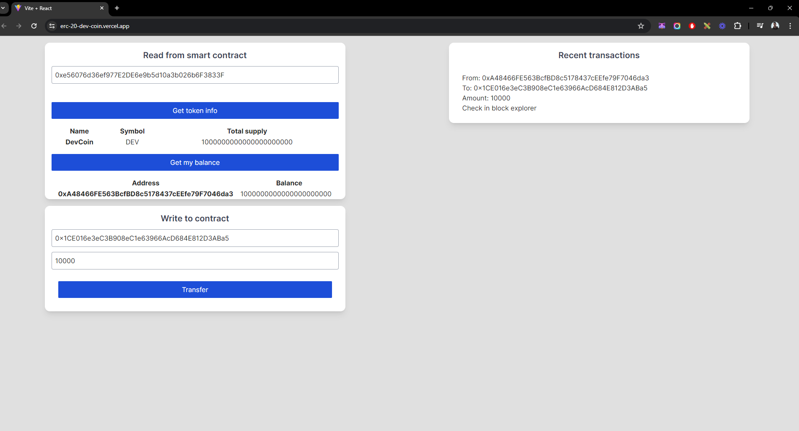

<h1 align='center'>DEV COIN</h1>

<h1 align="center">
  
</h1>

## About 🚀

DevCoin is a blockchain-based application that leverages React, Solidity, and Ethers.js to create, manage, and interact with an ERC20 token. The project is designed to provide users with an intuitive interface to handle DevCoin transactions, view transaction histories, and interact with the DevCoin smart contract seamlessly.

---

## Techs ✔
- [React JS](https://reactjs.org/)
- [Vite](https://vitejs.dev/)
- [Ethers](https://docs.ethers.org/v5/)
- [Solidity](https://soliditylang.org/)

---

## [Live mode](https://erc-20-dev-coin.vercel.app/) 🔗


## How to install 💻

```bash
#First clone this project on your preference path

$ git clone https://github.com/Luan4560/ERC20-DEV-COIN

# Then got to you path, open the project and install the dependecies.

$ yarn or npm install

# After that, just initilialize the project with:

$ yarn dev
```
---